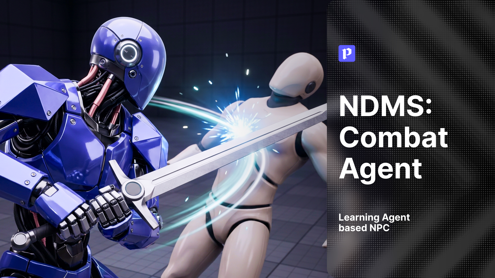

# NDMS: Боевой агент



<p align="center">
  
  
  
  <a href="https://www.fab.com"></a>
</p>

Боевой агент для Unreal Engine 5, принимающий тактические решения с помощью нейросетевой модели, обученной методом Proximal Policy Optimization (PPO).

> [!NOTE]
> **Демо-версия для Windows 10/11.** Архив `Demo_CombatAgent.zip` можно скачать в разделе [Releases](https://github.com/LLC-PANDORA/NDMS_CombatAgent/releases/latest).

## Запуск демо

1. Скачайте `Demo_CombatAgent.zip` на странице [Releases](https://github.com/LLC-PANDORA/NDMS_CombatAgent/latest).
2. Распакуйте архив в любую папку.
3. Запустите исполняемый файл `.exe` из распакованной папки.

## Мотивация

NPC на основе деревьев поведения и конечных автоматов предсказуемы по своей природе. Разнообразить бой в такой системе можно только за счёт большого числа заранее прописанных паттернов, однако это слишком трудозатратно, а игрок всё равно рано или поздно изучает поведение соперников и находит устойчивую тактику.

Проблему адаптивности решает построение принятия решений на основе модели, обученной методами машинного обучения. Такая модель учитывает текущую игровую ситуацию и способна подстраиваться под стиль конкретного игрока.

## Как это работает

В рамках проекта создана боевая система поединков на мечах, в которой игрок изначально находится в более выгодном положении: ему доступно больше видов атак, часть из которых невозможно парировать, а их урон выше. Кроме того, игрок может восстановить 20 единиц здоровья за одно действие.

За перемещение NPC к игроку и от него в случае усталости отвечает простой скрипт на основе деревьев поведения и конечных автоматов. Все боевые решения принимает обученная модель.

**Наблюдения.** Модель получает вектор из 40 вещественных значений: дистанцию и направление до игрока, его скорость и ориентацию, текущие боевые состояния игрока и NPC, значения здоровья, выносливость NPC, накопленный адреналин игрока, а также тип выполняемой игроком атаки и блока.

**Действия NPC.** На каждом шаге агент выбирает одно из 7 дискретных действий:
- Ожидание
- Рубящая атака
- Колющая атака
- Блок
- Парирование
- Уклонение назад
- Уклонение вперёд

**Функция награды.** Агент вознаграждется и штрафуется за событийные сигналы, благодаря чему и выстраивается модель определённого поведения NPC.

| Событие | Награда |
|---|---|
| NPC нанёс урон игроку | +3 |
| NPC заблокировал атаку игрока | +1.5 |
| NPC успешно уклонился от атаки | +2 |
| NPC часто применяет уклонения | −0.3 |
| NPC использовал уклонение зря | −0.5 |
| NPC получил урон | −2 |
| NPC истощил выносливость при попытке атаки | −0.5 |
| NPC атаковал вне зоны досягаемости | −0.5 |
| NPC промахнулся | −0.5 |
| NPC проиграл | −4 |
| Игрок проиграл | +4 |

Дополнительно на каждом такте боя учитываются пошагоые сигналы:
- бездействие дольше 5 тактов подряд, когда NPC находится на оптимальной дистанции для атаки — штраф −0.05;
- разница в очках здоровья между NPC и игроком — постоянно подталкивает NPC удерживать преимущество по здоровью;
- небольшой штраф −0.003 на каждом такте — не даёт эпизодам затягиваться без необходимости.

Обучение ведётся алгоритмом PPO (Proximal Policy Optimization): одна нейросеть (сеть политики) выбирает действие, вторая (сеть критика) оценивает, насколько выгодна текущая ситуация, и по этой оценке первая сеть постепенно корректируется в сторону более удачных решений.

**Честные условия боя.** Агент ограничен собственным запасом выносливости и получает только ту информацию, которая доступна и игроку. Внутренние таймеры и будущие события ему не передаются.

## Архитектура

Ниже показана архитектура ядра системы. В схему не включены вспомогательные компоненты: перемещение, здоровье, выносливость, адреналин, фокусировка на цели и другие. Они обеспечивают работу системы, но заменяемы и настраиваются независимо от её центральной части.

```text
        ┌────────────────────────┐
        │   Состояние боя        │  Компонент состояния NPC
        │   (NPC + игрок)        │  (дистанция, HP, выносливость...)
        └───────────┬────────────┘
                    │ наблюдения
                    ▼
        ┌────────────────────────┐  Собирает и трансформирует
        │   Сбор наблюдений      │  данные в вектор признаков
        └───────────┬────────────┘
                    ▼
        ┌────────────────────────┐
        │  Нейросеть политики    │  Выбор 1 из 7 действий
        └───────────┬────────────┘
                    │ действие
                    ▼
        ┌────────────────────────┐
        │  Боевая система NPC    │  Воспроизведение ожидания, атаки, 
        │                        │  блока, уклонения или парирования
        └───────────┬────────────┘
                    │ события боя
                    ▼
        ┌────────────────────────┐
        │  Расчёт награды        │  Учёт наград и штрафов,
        │  Нейросеть критика     │  оценка выбранного действия,
        │  Обновление PPO        │  обновление весов
        └────────────────────────┘
```

Вся тренировочная среда собрана средствами Unreal Engine 5 на Blueprints, без выгрузки логики боя во внешние программы.

## Технологии проекта

| Компонент | Описание |
|---|---|
| Unreal Engine 5 (Blueprints) | Игровая логика, боевая система, среда обучения |
| Глубокое обучение | Нейросеть политики (actor) и нейросеть критика (critic), обучаемые алгоритмом PPO |
| Инференс в реальном времени | Обученная политика выполняется во время игры. Передачу признаков в модель и получение решения обеспечивают небольшие нейронные сети |
| TensorBoard | Мониторинг обучения (средняя награда эпизода, доля побед) |

## Статус проекта

Работоспособность системы проверена. Критических ошибок, влияющих на процесс обучения и принятие решений, не обнаружено.

Системе необходима дальнейшая полировка и развитие: дополнительное обучение, тренировка новых разнообразных паттернов поведения, добавление игровых механик для создания более широкого спектра боевых ситуаций.

В перспективе возможно создание многоагентной системы, которая будет полностью управлять NPC в бою. Она возьмёт на себя не только боевые действия, но и перемещения, которые сейчас реализованы на деревьях поведения.

## Контакты и другие проекты

Если вы хотите связаться с нами или познакомиться с другими нашими проектами, заходите на сайт: **[pandora-llc.tilda.ws](https://pandora-llc.tilda.ws/)**

Полная версия системы с документацией скоро будет доступна на [Fab](https://www.fab.com).
